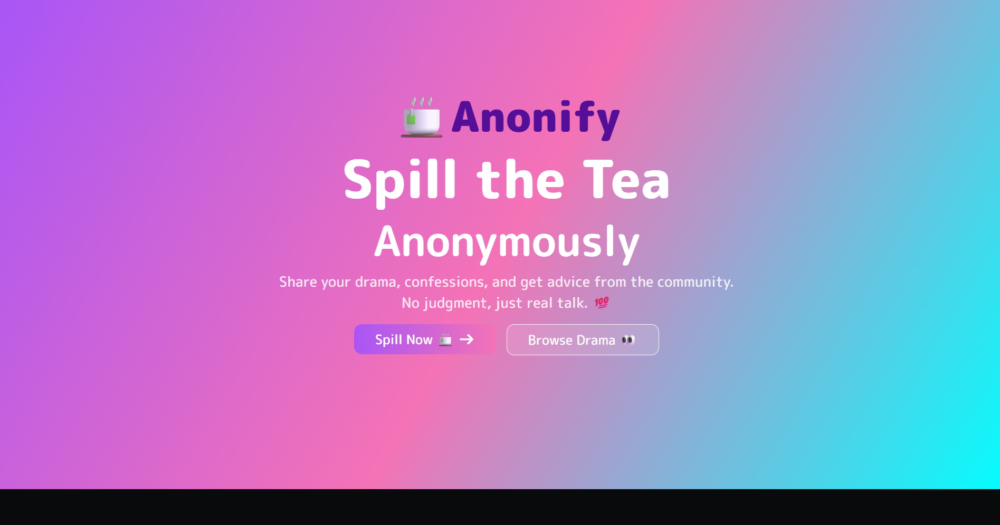
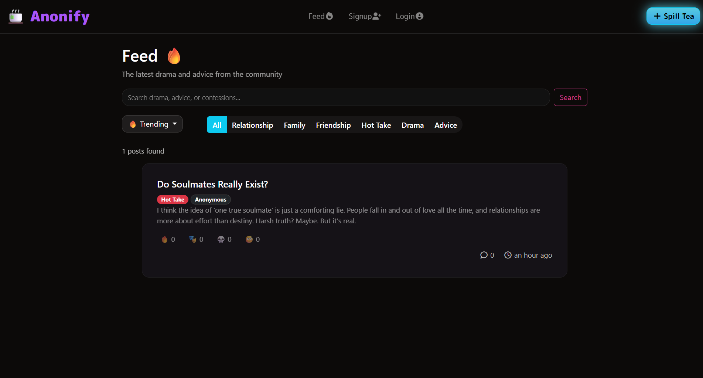
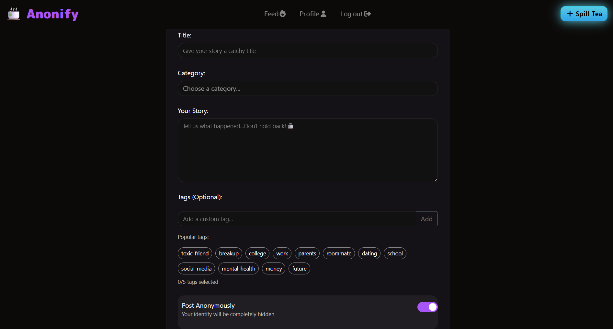

# ☕ Anonify: Spill the Tea. Anonymously.

Anonify is a web platform that allows users to share stories, confessions, and opinions completely anonymously.  
Whether it’s drama, advice, or unfiltered thoughts, Anonify is the space to speak your truth without judgment.

🌐 **Live Demo:** [anonify-4p60.onrender.com](https://anonify-4p60.onrender.com)

---

## ✨ Features

- 🔒 **Anonymous Posting:** Share your thoughts without revealing your identity.  
- 💬 **Community Feed:** View and react to posts from others in real time.  
- 😄 **Reactions & Feedback:** Express emotions through quick reactions and replies.  
- 📅 **Timestamped Posts:** Built-in Day.js support for human-friendly time display.  
- 🧭 **Category Tagging:** Sort and discover stories under categories like Advice, Drama, Relationship, etc.  
- 🌈 **Google Auth (Optional):** Integrated via Passport.js for secure login if needed.  
- 📧 **Email Notifications:** (Nodemailer ready) for user feedback or admin alerts.  
- 🧠 **Data Validation:** Powered by Joi for clean and safe data handling.  

---

## 🧩 Tech Stack

**Frontend:** EJS, EJS-Mate, HTML, CSS, JavaScript  
**Backend:** Node.js, Express.js  
**Database:** MongoDB (with `connect-mongo` for session storage)  
**Authentication:** Passport.js (Local + Google OAuth 2.0)  
**Other Tools:**  
- bcrypt — for password hashing  
- dayjs — for timestamps  
- dotenv — for environment configuration  
- method-override — for RESTful routes support  

---

## 📸 Screenshots  

  
  

  
  

---

Current Version: v1.0.0
: Expect more features, UI updates, and community tools coming soon!☕
  
